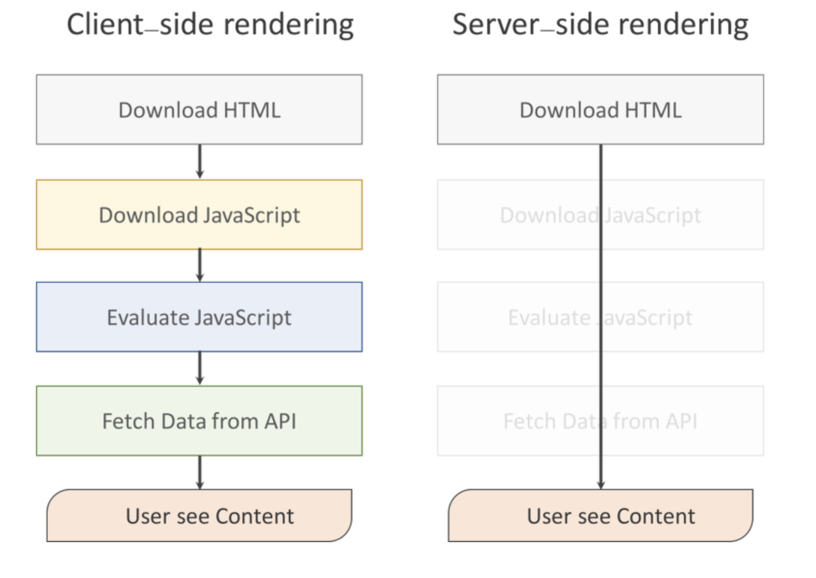

Section01
==

### 참조

[Next.js 제대로 알고 쓰자](https://medium.com/@msj9121/next-js-%EC%A0%9C%EB%8C%80%EB%A1%9C-%EC%95%8C%EA%B3%A0-%EC%93%B0%EC%9E%90-8727f76614c9)   
[SPA / Client Side Rendering 그리고 Server Side Rendering](https://velog.io/@haileyself/SPA-Client-Side-Rendering-%EA%B7%B8%EB%A6%AC%EA%B3%A0-Server-Side-Rendering-90k4ar8is1)

Next.JS 란
---
> React 의 SSR(Server side Rendering) 을 쉽게 구현할 수 있게 도와주는 프레임워크 입니다\

핵심 기능
---

- 코드 스플리팅

> 일반적인 리액트 싱글 페이지에서는 초기 렌더링 때 모든 컴포넌트를 내려받습니다.\
> 하지만 규모가 커지고, 용량이 커지면 로딩속도가 지연될 수 있는 문제가 있습니다.\
> Next 는 이러한 문제점을 개선해서 필요에 따라 파일을 불러올 수 있게 여러 개의 파일을 분리하는 코드 스플리팅을 사용하였습니다.\
> 예를 들어, 브라우저가 실행되고, 사용자가 접속을 하게되면, 첫 페이지인 index 만 불러오게 되고, 그 이후에 다른 페이지로 넘어갔을 때는 해당 페이지만 불러오게 됩니다.

- 간단한 클라이언트 사이드 라우팅 제공

> 사용 방법은 Router 와 Link 를 모두 import 해서 사용할 수 있습니다.\
> Link 에서는 href 와 as props 가 있는데 이 href 는 해당 페이지로 이동해주는 역할을 하고,\
> as 는 href 의 URL 을 조금 더 직관적으로 만들어주는 역할을 해줍니다.\
> Router 는 링크와 동일하게 해당 페이지로 이동해주는 역할을 하며 쉽게 Redirect 도 가능합니다.

SPA (Single Page Application)
---
> 최초 한번 페이지 전체를 로딩한 이후 부터는 데이터만 변경하여 사용할 수 있는 웹 어플리케이션 입니다.

CSR (Client Side Rendering)
---
> 클라이언트 사이드 렌더링은 SPA 로, 클라이언트 사이드에서 HTML 을 반환한 후에, JS가 동작하면서 데이터만을 주고 받아서 클라이언트에서 렌더링을 진행하는 것 입니다.

### 장점

- 사용자의 행동에 따라 필요한 부분만 다시 읽어들이기 때문에 SSR 보다 조금 더 빠른 인터렉션이 가능합니다
- 페이지 전체를 요청하지 않고 페이지에 필요한 부분만 변경하기 때문에, 모바일 네트워크에서도 빠른 속도로 렌더링이 가능합니다.
- lazy loading 을 지원 합니다.\
  *(페이지 로딩 시 중요하지 않은 리소스의 로딩을 늦추는 기술)*\
- 서버사이드 렌더링이 필요하지 않기 때문에 일관성있는 코드를 작성할 수 있습니다.

### 단점

- GoogleBot 과 SearchConsole 에 검색 노출이 되지 않습니다.
  *(브라우저가 없기 때문에 html 만 가져와서 검색에 뜨지 않습니다)*
- 페이지를 읽고, 자바스크립트를 읽은 후 화면을 그리는 시간까지 모두 마쳐야 콘텐츠가 사용자에게 보여지기 때문에 초기 구동 속도가 느립니다.

SSR (Server Side Rendering)
---
> 서버에서 렌더링을 하는 방식, 전통적인 웹 어플리케이션 렌더링 방식으로 사용자가 웹페이지에 접근할 때\
> 서버에 각각의 페이지에 대한 요청을 하며 서버에서 html, js 파일 등을 다 다운로드해서 화면에 렌더링 하는 방식 입니다.

### 장점

- 사용자가 처음으로 컨텐츠를 볼 수 있는 시점을 앞당길 수 있습니다.
- 검색엔진최적화 (SEO) 적용 용이합니다.

### 단점

- 모든 요청에 관해 필요한 부분만 수정하는 것이 아닌, 완전히 새 페이지를 로딩하고 랜더 해줍니다.
- 전체를 로딩하다보니 CSR 보다 느리고, bandwidth 를 많이 쓰고, 사용자 경험이 좋지 않습니다.\
  *(사용자가 처음으로 컨텐츠를 볼 수 있으나 script 가 로딩되지 않아서 버튼이 클릭되지 않는 현상이 있을 수 있습니다)*

CSR 과 SSR 비교
---

